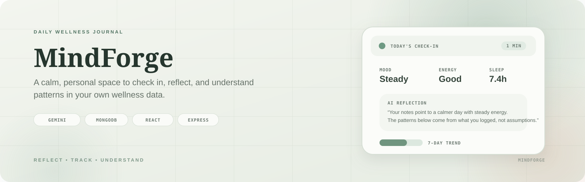
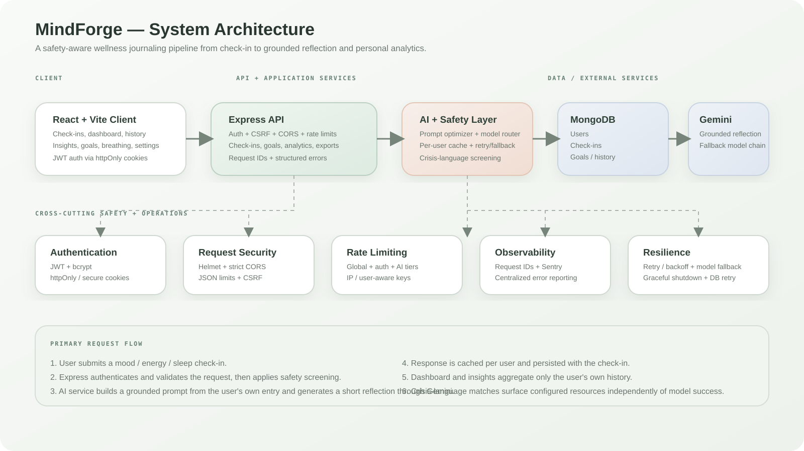

<p align="center">
  
</p>

<h1 align="center">MindForge</h1>

<p align="center"><strong>A daily wellness journaling app with grounded AI reflections and personal trend insights.</strong></p>

<p align="center">
  <a href="https://mind-forge-iota-ashy.vercel.app/">Live Demo</a> ·
  <a href="#architecture">Architecture</a> ·
  <a href="#getting-started">Getting Started</a> ·
  <a href="#testing-and-code-quality">Testing</a>
</p>

<p align="center">
  
  
  
  
  
</p>

## Overview

MindForge is a full-stack MERN wellness journaling application built around a simple loop: **check in, reflect, track patterns**.

Users can log mood, energy, sleep and free-form notes in under a minute. A safety-aware Gemini pipeline generates a short reflection grounded in the user's own entry rather than diagnosing, inventing facts, or presenting itself as clinical care.

The application also turns the accumulated check-ins into personal dashboards, weekly recaps, searchable history, habit tracking and emotion insights.

> **Important:** MindForge is a journaling and wellness companion, not a clinical or diagnostic tool. It is not a substitute for professional mental health care.

## Features

- Grounded AI reflections generated from the user's own check-in
- Guided and conversational daily check-in flows
- Mood, energy and sleep tracking with history and streaks
- Weekly recap and personal trend analysis
- Emotion insights including sleep/mood and mood/energy relationships
- Search and filter across historical check-ins
- Habit tracking with independent streaks
- Optional daily reminders
- Guided breathing exercises
- CSV and print/PDF-friendly export
- JWT authentication with httpOnly cookies
- Per-user AI response caching and model fallback/retry handling
- Crisis-language screening that can surface configured resources independently of model success
- Structured request logging, request IDs and optional Sentry error reporting
- Rate limiting, CSRF protection, Helmet, strict CORS and body-size limits
- 268 automated frontend/backend tests enforced in CI

## Architecture

<p align="center">
  
</p>

### Request flow

```text
React + Vite Client
        │
        ▼
    Express API
        │
        ├── JWT / CSRF / CORS / Rate Limiting
        ├── Check-ins / Goals / Analytics / Exports
        │
        ▼
   AI + Safety Layer
        │
        ├── Prompt optimization
        ├── Response cache
        ├── Retry + model fallback
        └── Crisis-language screening
        │
        ├───────────────┐
        ▼               ▼
   MongoDB         Google Gemini
```

The frontend and backend are intentionally separated. The backend keeps authentication, validation, safety controls, persistence and AI orchestration behind the API boundary, while the frontend focuses on the journaling and analytics experience.

## Tech Stack

| Layer | Technologies |
| --- | --- |
| Frontend | React 19, Vite, Tailwind CSS, Framer Motion, React Router |
| Backend | Node.js 20, Express.js |
| Database | MongoDB Atlas, Mongoose |
| Authentication | JWT, bcrypt, httpOnly cookies |
| AI | Google Gemini API |
| Security | Helmet, CORS, CSRF protection, express-rate-limit |
| Observability | Sentry, structured request logging |
| Testing | Vitest, Testing Library, Supertest, Autocannon |
| CI/CD | GitHub Actions, CodeQL, Dependabot, Gitleaks |
| Deployment | Vercel (frontend), Railway (backend) |

## Getting Started

### Prerequisites

- Node.js 20+
- MongoDB / MongoDB Atlas
- Google Gemini API key

### Install

```bash
git clone https://github.com/Zephyrex21/mind-forge.git
cd mind-forge
npm run setup
```

Create `server/.env` from `server/.env.example` and configure the required values:

```env
PORT=3001
NODE_ENV=development
MONGODB_URI=
JWT_SECRET=
JWT_EXPIRES_IN=7d
GEMINI_API_KEY=
CORS_ORIGIN=http://localhost:5173
```

### Run

```bash
npm run dev
```

Frontend: `http://localhost:5173`

The backend runs from the `server` workspace and connects to MongoDB using the configured environment variables.

## Testing and Code Quality

MindForge currently has **268 automated tests** across the frontend and backend.

```bash
# Frontend
npm test
npm run lint

# Backend
cd server
npm test
npm run lint
```

GitHub Actions runs the frontend and backend lint/test/build checks, production dependency audits, secret scanning and CodeQL analysis on pushes and pull requests.

## Production and Security

The backend includes several operational controls beyond the core API:

- tiered rate limiting for general, authentication and AI-generation traffic
- environment-aware secure cookies and JWT authentication
- strict CORS, Helmet headers, CSRF protection and JSON body limits
- request IDs for tracing requests through retries and AI fallback paths
- centralized unexpected-error reporting with optional Sentry integration
- graceful shutdown and MongoDB connection retry/backoff
- production dependency auditing, CodeQL and full-history secret scanning in CI
- cursor-based check-in pagination and a dedicated lightweight analytics endpoint

## Project Structure

```text
mind-forge/
├── src/                       # React + Vite frontend
│   ├── app/                   # providers and routes
│   ├── components/            # shared, conversation, editor and wellness UI
│   ├── features/              # auth and check-in flows
│   ├── hooks/                 # reusable React hooks
│   ├── services/              # frontend API clients
│   └── utils/                 # streaks, recap, insights, export utilities
│
├── server/                    # Node.js + Express backend
│   ├── routes/                # HTTP API routes
│   ├── models/                # Mongoose models
│   ├── middleware/            # auth, CSRF, rate limiting, logging, errors
│   ├── services/              # AI, safety and error reporting
│   ├── db/                    # database connection/reset helpers
│   ├── perf/                  # load-test tooling and results
│   └── scripts/               # operational scripts
│
├── docs/images/               # README banner + architecture diagram
└── .github/workflows/         # CI, security and quality gates
```

## Roadmap

MindForge is still evolving. The current direction is to improve the personal analytics experience, deepen the wellness journaling workflow, strengthen automation and observability, and continue refining the AI safety boundaries without turning the product into a clinical system.

## License

MindForge is released under the [MIT License](LICENSE).

---

<p align="center">Built as a thoughtful full-stack experiment in personal wellness journaling, grounded AI and production-oriented web engineering.</p>
